

<!-- ==================================================
     1. HERO DASHBOARD
================================================== -->

  

  
  
  
  

 

<!-- ==================================================
     2. WHAT I BUILD
================================================== -->

  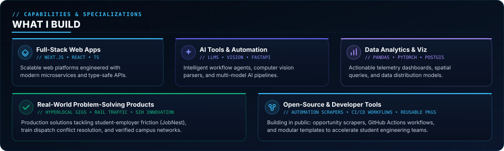

 

<!-- ==================================================
     3. HOBBIES & INTERESTS
================================================== -->

  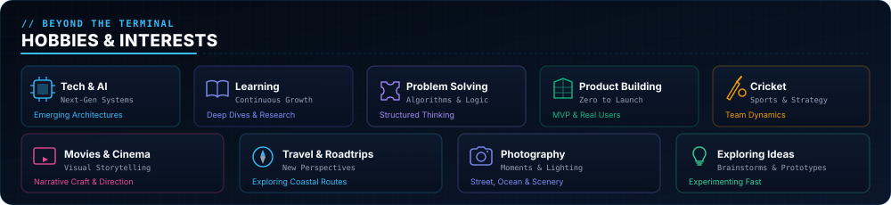

 

<!-- ==================================================
     4. TECH STACK
================================================== -->

  

 

<!-- ==================================================
     5. GITHUB IDENTITY
================================================== -->

  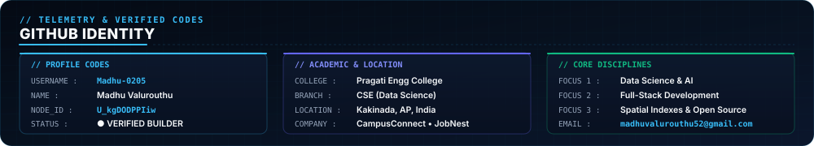

 

<!-- ==================================================
     6. GITHUB STATS
================================================== -->

  

 

<!-- ==================================================
     7. TOP LANGUAGES
================================================== -->

  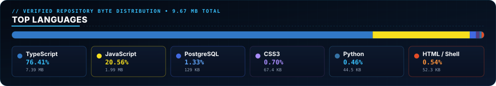

 

<!-- ==================================================
     8. GITHUB STREAK
================================================== -->

  

 

<!-- ==================================================
     9. CONTRIBUTION ACTIVITY MATRIX
================================================== -->

  

 

<!-- ==================================================
     10. FEATURED PROJECTS
================================================== -->

  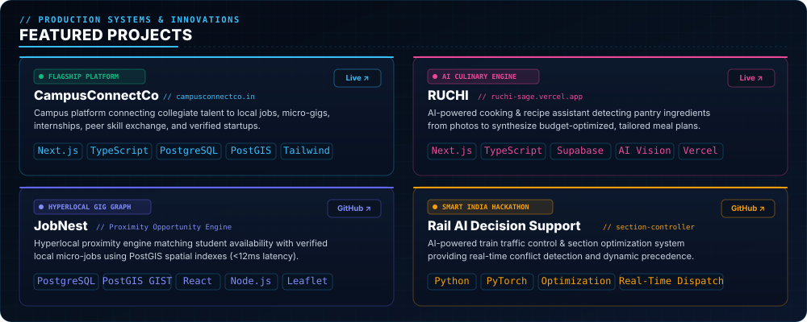

  <b>Production Access &amp; Source Code:</b> 
  <a href="https://campusconnectco.in"><b>CampusConnectCo</b> (Live Platform)</a> &bull; <a href="https://github.com/Madhu-0205/campusconnectco.in">Source</a>
  &nbsp;&nbsp;|&nbsp;&nbsp;
  <a href="https://ruchi-sage.vercel.app"><b>RUCHI</b> (Live App)</a> &bull; <a href="https://github.com/Madhu-0205/ruchi">Source</a>
  &nbsp;&nbsp;|&nbsp;&nbsp;
  <a href="https://github.com/Madhu-0205/JobNest"><b>JobNest</b> (Source)</a>
  &nbsp;&nbsp;|&nbsp;&nbsp;
  <a href="https://github.com/Madhu-0205/section-controller"><b>Rail AI DSS</b> (Source)</a>

 

<!-- ==================================================
     11. 3D CONTRIBUTION CITY
================================================== -->

  

 

<!-- ==================================================
     12. CONNECT WITH ME
================================================== -->

  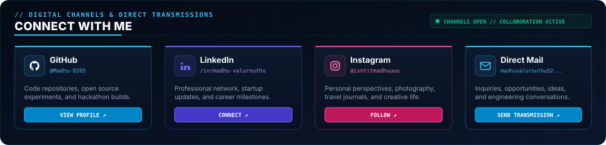

  
  &nbsp;
  
  &nbsp;
  
  &nbsp;
  

 

  Designed &amp; engineered for <b>Madhu Valurouthu</b> &bull; Real-time telemetry automatically refreshed via GitHub Actions

